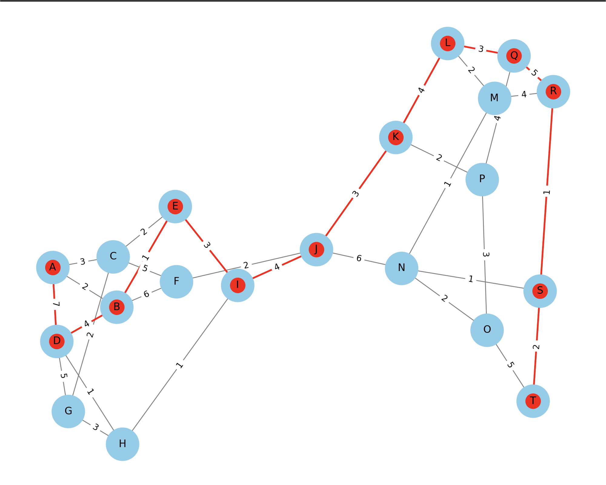

## Висновки

### Завдання 1: Створення та аналіз графа

Було створено граф, що представляє просту транспортну мережу міста з 20 вершинами (місцями) та 32 ребрами (дорогами між місцями). Основні характеристики графа:

- Кількість вершин: 20
- Кількість ребер: 32
- Ступені вершин:
  `{'A': 3, 'B': 4, 'C': 4, 'D': 4, 'E': 3, 'F': 3, 'G': 3, 'H': 3, 'I': 3, 'J': 4, 'K': 3, 'L': 3, 'M': 3, 'N': 4, 'O': 3, 'P': 3, 'Q': 3, 'R': 3, 'S': 3, 'T': 2}`

### Завдання 2: Знаходження шляхів за допомогою алгоритмів DFS і BFS

Було реалізовано алгоритми DFS та BFS для знаходження шляхів у графі від вершини 'A' до вершини 'T'. 

- **DFS шлях**: ['A', 'D', 'B', 'E', 'I', 'J', 'K', 'L', 'Q', 'R']
- **BFS шлях**: ['A', 'B', 'F', 'J', 'N', 'O', 'T']

#### Порівняння:

- **DFS (глибина-перший пошук)** досліджує якомога глибше кожну гілку перед поверненням назад. Тому шляхи можуть бути довшими і включати більше вершин перед тим, як досягти цілі.
- **BFS (ширина-перший пошук)** досліджує всі сусідні вершини поточного рівня перед переходом на наступний рівень. Тому він знаходить найкоротший шлях (за кількістю ребер) від початку до цілі.

### Завдання 3: Алгоритм Дейкстри для знаходження найкоротшого шляху

Було реалізовано алгоритм Дейкстри для знаходження найкоротших шляхів у графі з вагами ребер.

- **Найкоротший шлях (Дейкстра)**: ['A', 'B', 'E', 'I', 'J', 'N', 'S', 'T']

#### Висновок:

- Алгоритм Дейкстри враховує ваги ребер і знаходить найкоротший шлях за сумою ваг.
- DFS та BFS знаходять шляхи без врахування ваг ребер, тому результати можуть відрізнятися від результатів алгоритму Дейкстри.

### Візуалізація

Шляхи, знайдені алгоритмами DFS, BFS та Дейкстри, були візуалізовані на графі транспортної мережі з однаковим розташуванням вершин, що дозволяє легко порівняти різні шляхи.

